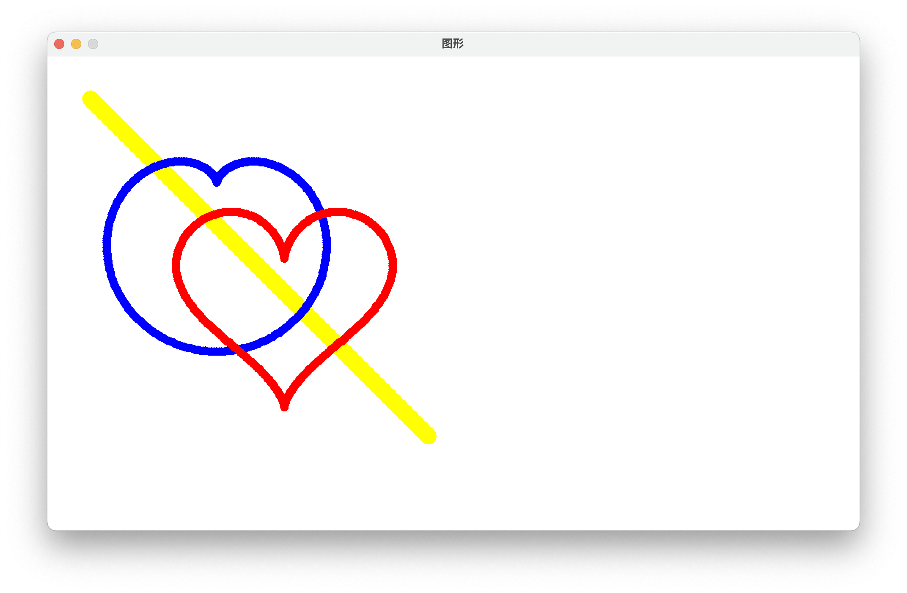

# Interpreter

一款函数绘图语言解释器

## 使用样例

### 源文件

`heart.txt`

```sql
-- 箭头
color is (255, 255, 0);

scale is (1, 1);
size is 10;

origin is (450, 450);
rot is pi;
for t from 0 to 400 step 1 draw(t, t);

-- 心形曲线
origin is (200, 200);
rot is pi/2;
size is 5;

-- 圆润型
color is (0, 0, 255);
scale is (50, 50);
for t from -pi to pi step pi/200 draw((2*cos(t)-cos(2*t)), (2*sin(t)-sin(2*t)));

-- 尖锐型
origin is (200+80, 200+80);
color is (255, 0, 0);
rot is pi;
scale is (8, 8);
for t from 0 to 2*pi step pi/200 draw(16*(sin(t)**3), 13*cos(t)-5*cos(2*t)-2*cos(3*t)-cos(4*t));
```

### 编译

```sh
mvn package  # 要求 JDK 版本最低为 14
```

### 运行

#### 运行主程序

```sh
java -jar target/Interpreter-1.0.1-jar-with-dependencies.jar heart.txt
```

输出：



#### 测试词法分析器

```sh
java -cp target/Interpreter-1.0.1-jar-with-dependencies.jar test.TestLexer heart.txt
```

输出：

```
|TYPE      |    LEXEME|     VALUE|  FUNCTION|        POSITION|
|----------|----------|----------|----------|----------------|
|COLOR     |     color|  0.000000|      null|  {line:2,col:1}|
|IS        |        is|  0.000000|      null|  {line:2,col:7}|
|L_BRACKET |         (|  0.000000|      null| {line:2,col:10}|
|CONST_ID  |       255|255.000000|      null| {line:2,col:11}|
|COMMA     |         ,|  0.000000|      null| {line:2,col:14}|
|CONST_ID  |       255|255.000000|      null| {line:2,col:16}|
|COMMA     |         ,|  0.000000|      null| {line:2,col:19}|
|CONST_ID  |         0|  0.000000|      null| {line:2,col:21}|
|R_BRACKET |         )|  0.000000|      null| {line:2,col:22}|
|SEMICO    |         ;|  0.000000|      null| {line:2,col:23}|
|SCALE     |     scale|  0.000000|      null|  {line:4,col:1}|
|IS        |        is|  0.000000|      null|  {line:4,col:7}|
|L_BRACKET |         (|  0.000000|      null| {line:4,col:10}|
|CONST_ID  |         1|  1.000000|      null| {line:4,col:11}|
|COMMA     |         ,|  0.000000|      null| {line:4,col:12}|
|CONST_ID  |         1|  1.000000|      null| {line:4,col:14}|
|R_BRACKET |         )|  0.000000|      null| {line:4,col:15}|
|SEMICO    |         ;|  0.000000|      null| {line:4,col:16}|
|SIZE      |      size|  0.000000|      null|  {line:5,col:1}|
|IS        |        is|  0.000000|      null|  {line:5,col:6}|
|CONST_ID  |        10| 10.000000|      null|  {line:5,col:9}|
|SEMICO    |         ;|  0.000000|      null| {line:5,col:11}|
|ORIGIN    |    origin|  0.000000|      null|  {line:7,col:1}|
|IS        |        is|  0.000000|      null|  {line:7,col:8}|
|L_BRACKET |         (|  0.000000|      null| {line:7,col:11}|
|CONST_ID  |       450|450.000000|      null| {line:7,col:12}|
|COMMA     |         ,|  0.000000|      null| {line:7,col:15}|
|CONST_ID  |       450|450.000000|      null| {line:7,col:17}|
|R_BRACKET |         )|  0.000000|      null| {line:7,col:20}|
|SEMICO    |         ;|  0.000000|      null| {line:7,col:21}|
|ROT       |       rot|  0.000000|      null|  {line:8,col:1}|
|IS        |        is|  0.000000|      null|  {line:8,col:5}|
|CONST_ID  |        pi|  3.141593|      null|  {line:8,col:8}|
|SEMICO    |         ;|  0.000000|      null| {line:8,col:10}|
|FOR       |       for|  0.000000|      null|  {line:9,col:1}|
|T         |         t|  0.000000|      null|  {line:9,col:5}|
|FROM      |      from|  0.000000|      null|  {line:9,col:7}|
|CONST_ID  |         0|  0.000000|      null| {line:9,col:12}|
|TO        |        to|  0.000000|      null| {line:9,col:14}|
|CONST_ID  |       400|400.000000|      null| {line:9,col:17}|
|STEP      |      step|  0.000000|      null| {line:9,col:21}|
|CONST_ID  |         1|  1.000000|      null| {line:9,col:26}|
|DRAW      |      draw|  0.000000|      null| {line:9,col:28}|
|L_BRACKET |         (|  0.000000|      null| {line:9,col:32}|
|T         |         t|  0.000000|      null| {line:9,col:33}|
|COMMA     |         ,|  0.000000|      null| {line:9,col:34}|
|T         |         t|  0.000000|      null| {line:9,col:36}|
|R_BRACKET |         )|  0.000000|      null| {line:9,col:37}|
|SEMICO    |         ;|  0.000000|      null| {line:9,col:38}|
|ORIGIN    |    origin|  0.000000|      null| {line:12,col:1}|
|IS        |        is|  0.000000|      null| {line:12,col:8}|
|L_BRACKET |         (|  0.000000|      null|{line:12,col:11}|
|CONST_ID  |       200|200.000000|      null|{line:12,col:12}|
|COMMA     |         ,|  0.000000|      null|{line:12,col:15}|
|CONST_ID  |       200|200.000000|      null|{line:12,col:17}|
|R_BRACKET |         )|  0.000000|      null|{line:12,col:20}|
|SEMICO    |         ;|  0.000000|      null|{line:12,col:21}|
|ROT       |       rot|  0.000000|      null| {line:13,col:1}|
|IS        |        is|  0.000000|      null| {line:13,col:5}|
|CONST_ID  |        pi|  3.141593|      null| {line:13,col:8}|
|DIV       |         /|  0.000000|      null|{line:13,col:10}|
|CONST_ID  |         2|  2.000000|      null|{line:13,col:11}|
|SEMICO    |         ;|  0.000000|      null|{line:13,col:12}|
|SIZE      |      size|  0.000000|      null| {line:14,col:1}|
|IS        |        is|  0.000000|      null| {line:14,col:6}|
|CONST_ID  |         5|  5.000000|      null| {line:14,col:9}|
|SEMICO    |         ;|  0.000000|      null|{line:14,col:10}|
|COLOR     |     color|  0.000000|      null| {line:17,col:1}|
|IS        |        is|  0.000000|      null| {line:17,col:7}|
|L_BRACKET |         (|  0.000000|      null|{line:17,col:10}|
|CONST_ID  |         0|  0.000000|      null|{line:17,col:11}|
|COMMA     |         ,|  0.000000|      null|{line:17,col:12}|
|CONST_ID  |         0|  0.000000|      null|{line:17,col:14}|
|COMMA     |         ,|  0.000000|      null|{line:17,col:15}|
|CONST_ID  |       255|255.000000|      null|{line:17,col:17}|
|R_BRACKET |         )|  0.000000|      null|{line:17,col:20}|
|SEMICO    |         ;|  0.000000|      null|{line:17,col:21}|
|SCALE     |     scale|  0.000000|      null| {line:18,col:1}|
|IS        |        is|  0.000000|      null| {line:18,col:7}|
|L_BRACKET |         (|  0.000000|      null|{line:18,col:10}|
|CONST_ID  |        50| 50.000000|      null|{line:18,col:11}|
|COMMA     |         ,|  0.000000|      null|{line:18,col:13}|
|CONST_ID  |        50| 50.000000|      null|{line:18,col:15}|
|R_BRACKET |         )|  0.000000|      null|{line:18,col:17}|
|SEMICO    |         ;|  0.000000|      null|{line:18,col:18}|
|FOR       |       for|  0.000000|      null| {line:19,col:1}|
|T         |         t|  0.000000|      null| {line:19,col:5}|
|FROM      |      from|  0.000000|      null| {line:19,col:7}|
|MINUS     |         -|  0.000000|      null|{line:19,col:12}|
|CONST_ID  |        pi|  3.141593|      null|{line:19,col:13}|
|TO        |        to|  0.000000|      null|{line:19,col:16}|
|CONST_ID  |        pi|  3.141593|      null|{line:19,col:19}|
|STEP      |      step|  0.000000|      null|{line:19,col:22}|
|CONST_ID  |        pi|  3.141593|      null|{line:19,col:27}|
|DIV       |         /|  0.000000|      null|{line:19,col:29}|
|CONST_ID  |       200|200.000000|      null|{line:19,col:30}|
|DRAW      |      draw|  0.000000|      null|{line:19,col:34}|
|L_BRACKET |         (|  0.000000|      null|{line:19,col:38}|
|L_BRACKET |         (|  0.000000|      null|{line:19,col:39}|
|CONST_ID  |         2|  2.000000|      null|{line:19,col:40}|
|MUL       |         *|  0.000000|      null|{line:19,col:41}|
|FUNC      |       cos|  0.000000|       cos|{line:19,col:42}|
|L_BRACKET |         (|  0.000000|      null|{line:19,col:45}|
|T         |         t|  0.000000|      null|{line:19,col:46}|
|R_BRACKET |         )|  0.000000|      null|{line:19,col:47}|
|MINUS     |         -|  0.000000|      null|{line:19,col:48}|
|FUNC      |       cos|  0.000000|       cos|{line:19,col:49}|
|L_BRACKET |         (|  0.000000|      null|{line:19,col:52}|
|CONST_ID  |         2|  2.000000|      null|{line:19,col:53}|
|MUL       |         *|  0.000000|      null|{line:19,col:54}|
|T         |         t|  0.000000|      null|{line:19,col:55}|
|R_BRACKET |         )|  0.000000|      null|{line:19,col:56}|
|R_BRACKET |         )|  0.000000|      null|{line:19,col:57}|
|COMMA     |         ,|  0.000000|      null|{line:19,col:58}|
|L_BRACKET |         (|  0.000000|      null|{line:19,col:60}|
|CONST_ID  |         2|  2.000000|      null|{line:19,col:61}|
|MUL       |         *|  0.000000|      null|{line:19,col:62}|
|FUNC      |       sin|  0.000000|       sin|{line:19,col:63}|
|L_BRACKET |         (|  0.000000|      null|{line:19,col:66}|
|T         |         t|  0.000000|      null|{line:19,col:67}|
|R_BRACKET |         )|  0.000000|      null|{line:19,col:68}|
|MINUS     |         -|  0.000000|      null|{line:19,col:69}|
|FUNC      |       sin|  0.000000|       sin|{line:19,col:70}|
|L_BRACKET |         (|  0.000000|      null|{line:19,col:73}|
|CONST_ID  |         2|  2.000000|      null|{line:19,col:74}|
|MUL       |         *|  0.000000|      null|{line:19,col:75}|
|T         |         t|  0.000000|      null|{line:19,col:76}|
|R_BRACKET |         )|  0.000000|      null|{line:19,col:77}|
|R_BRACKET |         )|  0.000000|      null|{line:19,col:78}|
|R_BRACKET |         )|  0.000000|      null|{line:19,col:79}|
|SEMICO    |         ;|  0.000000|      null|{line:19,col:80}|
|ORIGIN    |    origin|  0.000000|      null| {line:22,col:1}|
|IS        |        is|  0.000000|      null| {line:22,col:8}|
|L_BRACKET |         (|  0.000000|      null|{line:22,col:11}|
|CONST_ID  |       200|200.000000|      null|{line:22,col:12}|
|PLUS      |         +|  0.000000|      null|{line:22,col:15}|
|CONST_ID  |        80| 80.000000|      null|{line:22,col:16}|
|COMMA     |         ,|  0.000000|      null|{line:22,col:18}|
|CONST_ID  |       200|200.000000|      null|{line:22,col:20}|
|PLUS      |         +|  0.000000|      null|{line:22,col:23}|
|CONST_ID  |        80| 80.000000|      null|{line:22,col:24}|
|R_BRACKET |         )|  0.000000|      null|{line:22,col:26}|
|SEMICO    |         ;|  0.000000|      null|{line:22,col:27}|
|COLOR     |     color|  0.000000|      null| {line:23,col:1}|
|IS        |        is|  0.000000|      null| {line:23,col:7}|
|L_BRACKET |         (|  0.000000|      null|{line:23,col:10}|
|CONST_ID  |       255|255.000000|      null|{line:23,col:11}|
|COMMA     |         ,|  0.000000|      null|{line:23,col:14}|
|CONST_ID  |         0|  0.000000|      null|{line:23,col:16}|
|COMMA     |         ,|  0.000000|      null|{line:23,col:17}|
|CONST_ID  |         0|  0.000000|      null|{line:23,col:19}|
|R_BRACKET |         )|  0.000000|      null|{line:23,col:20}|
|SEMICO    |         ;|  0.000000|      null|{line:23,col:21}|
|ROT       |       rot|  0.000000|      null| {line:24,col:1}|
|IS        |        is|  0.000000|      null| {line:24,col:5}|
|CONST_ID  |        pi|  3.141593|      null| {line:24,col:8}|
|SEMICO    |         ;|  0.000000|      null|{line:24,col:10}|
|SCALE     |     scale|  0.000000|      null| {line:25,col:1}|
|IS        |        is|  0.000000|      null| {line:25,col:7}|
|L_BRACKET |         (|  0.000000|      null|{line:25,col:10}|
|CONST_ID  |         8|  8.000000|      null|{line:25,col:11}|
|COMMA     |         ,|  0.000000|      null|{line:25,col:12}|
|CONST_ID  |         8|  8.000000|      null|{line:25,col:14}|
|R_BRACKET |         )|  0.000000|      null|{line:25,col:15}|
|SEMICO    |         ;|  0.000000|      null|{line:25,col:16}|
|FOR       |       for|  0.000000|      null| {line:26,col:1}|
|T         |         t|  0.000000|      null| {line:26,col:5}|
|FROM      |      from|  0.000000|      null| {line:26,col:7}|
|CONST_ID  |         0|  0.000000|      null|{line:26,col:12}|
|TO        |        to|  0.000000|      null|{line:26,col:14}|
|CONST_ID  |         2|  2.000000|      null|{line:26,col:17}|
|MUL       |         *|  0.000000|      null|{line:26,col:18}|
|CONST_ID  |        pi|  3.141593|      null|{line:26,col:19}|
|STEP      |      step|  0.000000|      null|{line:26,col:22}|
|CONST_ID  |        pi|  3.141593|      null|{line:26,col:27}|
|DIV       |         /|  0.000000|      null|{line:26,col:29}|
|CONST_ID  |       200|200.000000|      null|{line:26,col:30}|
|DRAW      |      draw|  0.000000|      null|{line:26,col:34}|
|L_BRACKET |         (|  0.000000|      null|{line:26,col:38}|
|CONST_ID  |        16| 16.000000|      null|{line:26,col:39}|
|MUL       |         *|  0.000000|      null|{line:26,col:41}|
|L_BRACKET |         (|  0.000000|      null|{line:26,col:42}|
|FUNC      |       sin|  0.000000|       sin|{line:26,col:43}|
|L_BRACKET |         (|  0.000000|      null|{line:26,col:46}|
|T         |         t|  0.000000|      null|{line:26,col:47}|
|R_BRACKET |         )|  0.000000|      null|{line:26,col:48}|
|POWER     |        **|  0.000000|      null|{line:26,col:49}|
|CONST_ID  |         3|  3.000000|      null|{line:26,col:51}|
|R_BRACKET |         )|  0.000000|      null|{line:26,col:52}|
|COMMA     |         ,|  0.000000|      null|{line:26,col:53}|
|CONST_ID  |        13| 13.000000|      null|{line:26,col:55}|
|MUL       |         *|  0.000000|      null|{line:26,col:57}|
|FUNC      |       cos|  0.000000|       cos|{line:26,col:58}|
|L_BRACKET |         (|  0.000000|      null|{line:26,col:61}|
|T         |         t|  0.000000|      null|{line:26,col:62}|
|R_BRACKET |         )|  0.000000|      null|{line:26,col:63}|
|MINUS     |         -|  0.000000|      null|{line:26,col:64}|
|CONST_ID  |         5|  5.000000|      null|{line:26,col:65}|
|MUL       |         *|  0.000000|      null|{line:26,col:66}|
|FUNC      |       cos|  0.000000|       cos|{line:26,col:67}|
|L_BRACKET |         (|  0.000000|      null|{line:26,col:70}|
|CONST_ID  |         2|  2.000000|      null|{line:26,col:71}|
|MUL       |         *|  0.000000|      null|{line:26,col:72}|
|T         |         t|  0.000000|      null|{line:26,col:73}|
|R_BRACKET |         )|  0.000000|      null|{line:26,col:74}|
|MINUS     |         -|  0.000000|      null|{line:26,col:75}|
|CONST_ID  |         2|  2.000000|      null|{line:26,col:76}|
|MUL       |         *|  0.000000|      null|{line:26,col:77}|
|FUNC      |       cos|  0.000000|       cos|{line:26,col:78}|
|L_BRACKET |         (|  0.000000|      null|{line:26,col:81}|
|CONST_ID  |         3|  3.000000|      null|{line:26,col:82}|
|MUL       |         *|  0.000000|      null|{line:26,col:83}|
|T         |         t|  0.000000|      null|{line:26,col:84}|
|R_BRACKET |         )|  0.000000|      null|{line:26,col:85}|
|MINUS     |         -|  0.000000|      null|{line:26,col:86}|
|FUNC      |       cos|  0.000000|       cos|{line:26,col:87}|
|L_BRACKET |         (|  0.000000|      null|{line:26,col:90}|
|CONST_ID  |         4|  4.000000|      null|{line:26,col:91}|
|MUL       |         *|  0.000000|      null|{line:26,col:92}|
|T         |         t|  0.000000|      null|{line:26,col:93}|
|R_BRACKET |         )|  0.000000|      null|{line:26,col:94}|
|R_BRACKET |         )|  0.000000|      null|{line:26,col:95}|
|SEMICO    |         ;|  0.000000|      null|{line:26,col:96}|
```

#### 测试语法分析器

```sh
java -cp target/Interpreter-1.0.1-jar-with-dependencies.jar test.TestParser heart.txt
```

输出：

```
E
  COLOR
    CONST_ID
    CONST_ID
    CONST_ID
  SCALE
    CONST_ID
    CONST_ID
  SIZE
    CONST_ID
  ORIGIN
    CONST_ID
    CONST_ID
  ROT
    CONST_ID
  FOR
    CONST_ID
    CONST_ID
    CONST_ID
    T
    T
  ORIGIN
    CONST_ID
    CONST_ID
  ROT
    DIV
      CONST_ID
      CONST_ID
  SIZE
    CONST_ID
  COLOR
    CONST_ID
    CONST_ID
    CONST_ID
  SCALE
    CONST_ID
    CONST_ID
  FOR
    MINUS
      CONST_ID
    CONST_ID
    DIV
      CONST_ID
      CONST_ID
    MINUS
      MUL
        CONST_ID
        FUNC
          T
      FUNC
        MUL
          CONST_ID
          T
    MINUS
      MUL
        CONST_ID
        FUNC
          T
      FUNC
        MUL
          CONST_ID
          T
  ORIGIN
    PLUS
      CONST_ID
      CONST_ID
    PLUS
      CONST_ID
      CONST_ID
  COLOR
    CONST_ID
    CONST_ID
    CONST_ID
  ROT
    CONST_ID
  SCALE
    CONST_ID
    CONST_ID
  FOR
    CONST_ID
    MUL
      CONST_ID
      CONST_ID
    DIV
      CONST_ID
      CONST_ID
    MUL
      CONST_ID
      POWER
        FUNC
          T
        CONST_ID
    MINUS
      MINUS
        MINUS
          MUL
            CONST_ID
            FUNC
              T
          MUL
            CONST_ID
            FUNC
              MUL
                CONST_ID
                T
        MUL
          CONST_ID
          FUNC
            MUL
              CONST_ID
              T
      FUNC
        MUL
          CONST_ID
          T
```
